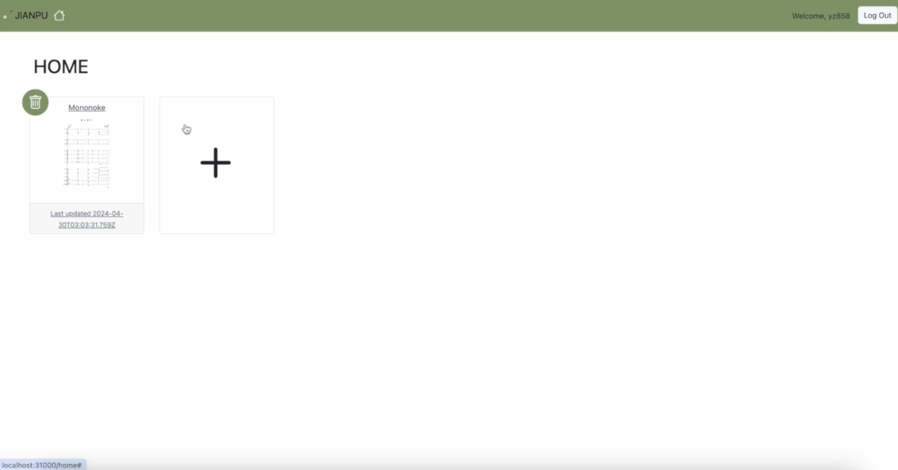
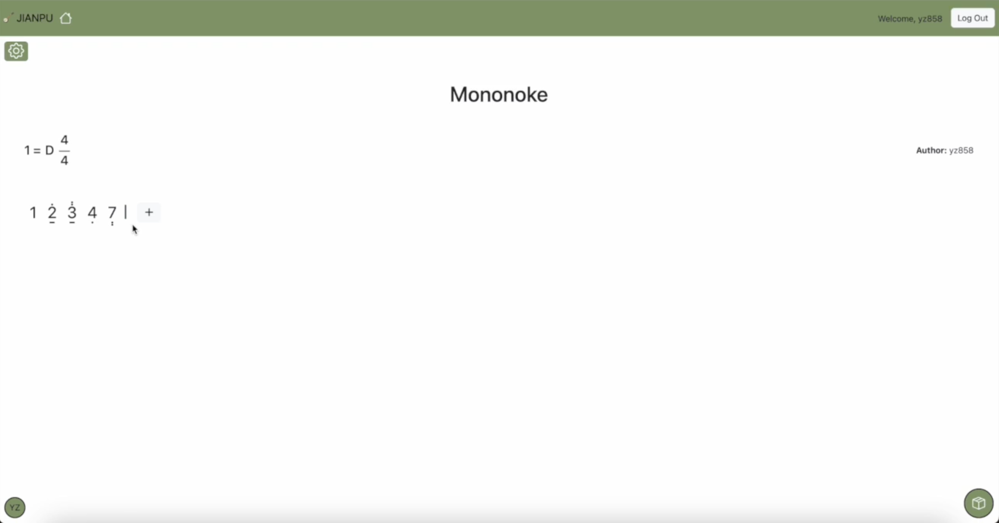
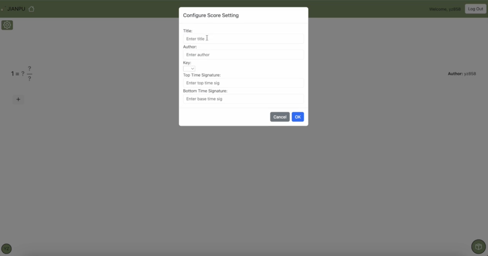
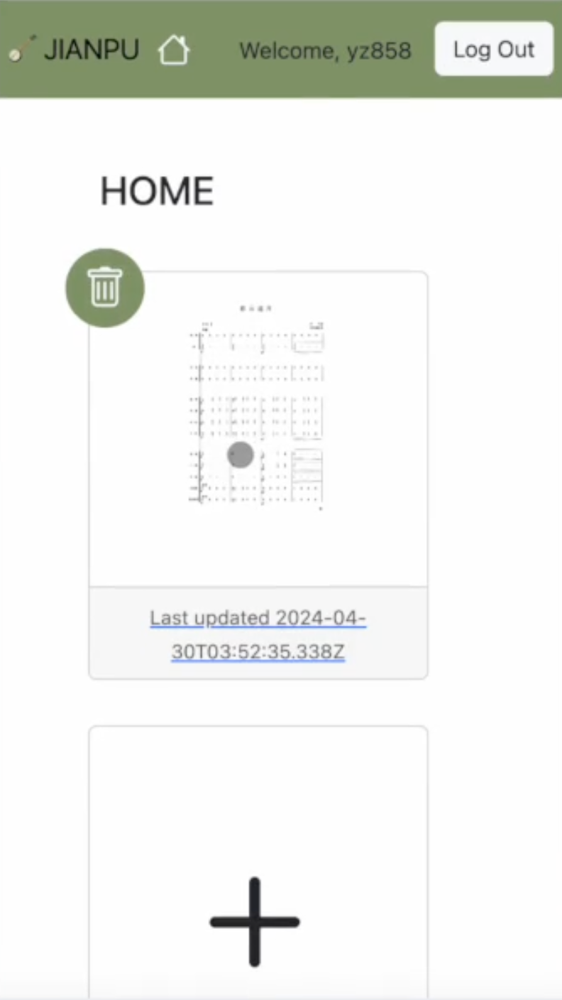
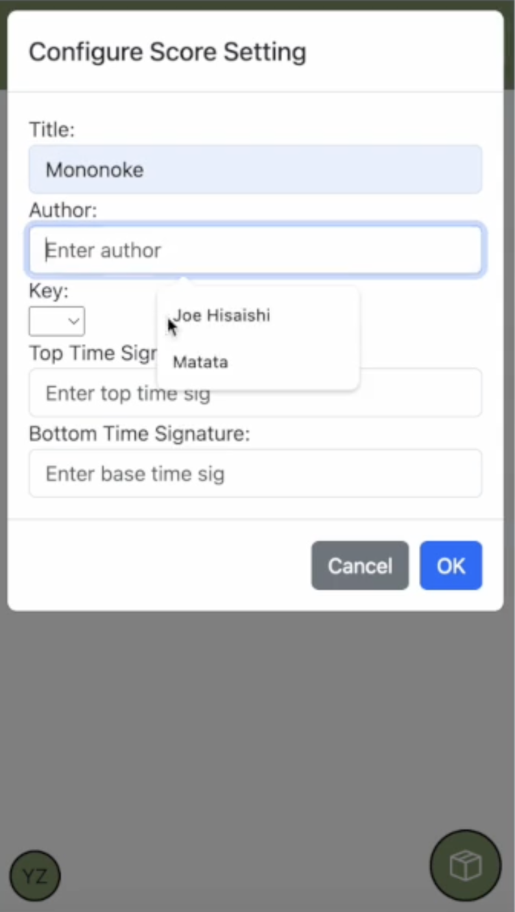

# NumScore

<!-- ## Development Steps
1. Set up MongoDB via Docker using `docker run -p 127.0.0.1:27017:27017 -d --rm --name mongo mongo:7.0.5`
2. Move into the **/server** folder, install all packages using `npm install` and set up using `npm run setup`, then run using `npm run start` as normal user or `GROUP=numscoreadmin npm run start` as **admin**
3. Move into the **/ui** folder and install all packages using `npm install` and run using `npm run dev`
4. Test in browser using `localhost:8130` rather than `127.0.0.1:8130` -->
## Demo
[Demo](https://duke.hosted.panopto.com/Panopto/Pages/Viewer.aspx?id=4ba5ae54-14a5-4a2f-89d1-b162004113a7)

## Dev Role
- Frontend & Backend: Yufei (Selina) Zhan
- CI/CD & Deplolyment: Honggang (Peter) Min

## Feactures

### Home Page (Add Score, Delete Score)
  

### Score Page (CRUD Note)
  

### Score Configuration 
  

### Responsive Web Design on Mobile
  
  

## Usage
1. Clone the repo
2. Inside the **/server** folder, run `docker build -t numscore-server .`
3. Inside the **/ui** folder, run `docker build -t numscore-ui .`
4. In the root **/numscore** folder, run `kubectl create -f k8s/` for the first time and run `kubectl delete -f k8s/` beforehand if errored
5. Access the service with `localhost:31000`
6. To connect with the mongo database, find out the db's pod name using `kubectl get pods`, then use `kubectl port-forward <POD_NAME> 37017:27017` to expose the database externally via `localhost:37017`
7. To access the dummy user for testing purpose, use `http://localhost:31000/api/login?key=foo-bar-baz&user=dalton&role=admin`

## RBAC
There two types of users with difference access level to the various features of the app:
1. the normal user that interacts with the app
2. the admin that can manage all the scores and users

Difference between 2 user types:
- Home Page: admin sees all the scores of all users while the users only see scores they have access to
- Score Page: admin can see the score but have no editting power or see any relevant feature whlie the users can edit scores they have access to

Specifically for a particular score, the user can be either "creator", "editor" or "viewer" with descending access power.

## Materials
- Proposal Slide: https://docs.google.com/presentation/d/1BCnQpx_AVTnucI1mn_eJB0B65a-GHJRz5DY1_JtGt2w/edit?usp=sharing
- Figma Design: https://www.figma.com/file/2oxmgxjv9F0Rgv09jFzdrz/Numbered-Music-Score-Project?type=design&node-id=0%3A1&mode=design&t=IG5rhLHNdycjPD7H-1

## Todo
- [x] Tech stack: responsive Vue.router frontend, Node backend, MongoDB database
- [x] Use OIDC for user login/authentication 
- [x] A form (besides login) showing at least 4 fields
- [x] Supports multiple authenticated users (managed using database)
- [x] Load-balanced scale-out REST API (load balancing gets handled by kubernetes)
- [x] Basic E2E test suite
- [x] Run on Kubernetes
- [x] Extra 1: CI/CD pipeline
- [x] Extra 2: RBAC
- [x] Show project in mobile device
- [x] Concurrency: when 1 user submits while the other user didn't refresh and tried to submit too

## Submission (5x assignment grades) due **Saturday, April 29, 11:59pm**
1. Git repo with small commits
2. Demo video including E2E test (presentation style, everyone appears, explain safe concurrency handling, hack into app using curl)

## Note
1. package.json has different versions of mongodb and typescripe as lecture22-oidc; some version variations in devDependenciesi too
2. removed 'connect-mongo'package as MongoStore is not needed
